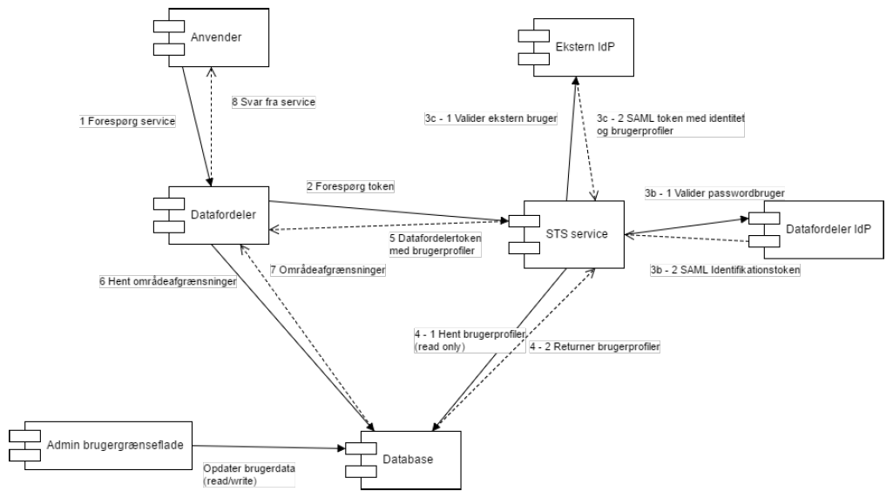

.. _sts-and-how-it-is-used:

STS og hvordan datafordeleren anvender det
==========================================

Her finder du et overblik over :ref:`Security Token Service (STS) <security-token-service>` og bruger/profil/rolle systemet for Grønlands Datafordeler.

Dokumentet beskriver datamodellen der ligger til grund for adgangsbegrænsning og login i datafordeleren samt hvordan adgangsdata opdateres og hvordan de anvendes ved udstedelse af datafordelertokens fra STS’en. :ref:`Ordlisten <wordlist>` kan være en hjælp, hvis det er ukendt teknik.

Når man arbejder med personfølsomme data og lignende, skal autorisation (hvad må anvender) og autentifikation (hvem er anvender) være korrekt.

Introduktion
------------

Dette dokument giver et overblik over STS og bruger/profil/rolle systemet for den Grønlands Datafordeler. Dokumentet beskriver datamodellen der ligger til grund for adgangsbegrænsning og login i datafordeleren samt hvordan adgangsdata opdateres og hvordan de anvendes ved udstedelse af datafordelertokens fra STS’en.

De enkelte komponenter og processer er illustreret nedenfor.

Klientcertifikat er en forudsætning for nogle typer forespørgsler
^^^^^^^^^^^^^^^^^^^^^^^^^^^^^^^^^^^^^^^^^^^^^^^^^^^^^^^^^^^^^^^^^

Nogle typer af forespørgsler kræver ikke certifikater for login, f.eks. en liste over alle byer og bygder. Hvis du er i tvivl om du skal godkendes, kan du prøve at stille en forespørgsel og resultatet vil være svaret eller en afvisning.

Klientcertifikat kræves for at kunne spørge efter udvalgte fortrolige oplysninger. Klientcertifikater er bevis for at man nu også er den som man giver sig ud for at være. Certifikater udstedes af autoriteter, som står inden for at personen eller virksomheden nu også er de rigtige. Du kan se mere i ordlisten om :ref:`Certificat <certificat>` og :ref:`Certificat-typer. <certificat-typer>`

Hvordan man får et certifikat, installerer det og anvender det, er meget forskelligt. Den opgave ligger uden for denne vejledning.

Adgang til datafordeleren via STS
---------------------------------

STS’ens opgave er at udstede SAML2 tokens der identificerer en bruger og angiver hvilke adgange brugeren har til den ønskede service. Forløbet vil typisk være som følger (og illustreret nedenfor):

1. En anvender laver en forespørgsel til datafordeleren
^^^^^^^^^^^^^^^^^^^^^^^^^^^^^^^^^^^^^^^^^^^^^^^^^^^^^^^

*TODO* EKSEMPEL PÅ FIKTIV PERSONSØGNING MED CERTIFIKAT

2. Datafordeleren undersøger om bruger allerede har en sikker session
^^^^^^^^^^^^^^^^^^^^^^^^^^^^^^^^^^^^^^^^^^^^^^^^^^^^^^^^^^^^^^^^^^^^^

Datafordeleren ser at brugeren ikke har nogen aktiv session og at den ønskede service kræver specielle rettigheder. Den viderestiller derfor brugeren til STS’en for at få udstedt en datafordelertoken.

Hvis bruger har en aktiv session, sendes brugeren direkte til trin 8.

3. Brugeren identificeres nu ved hjælp af sit certifikat
^^^^^^^^^^^^^^^^^^^^^^^^^^^^^^^^^^^^^^^^^^^^^^^^^^^^^^^^

Afhængigt af brugerens adgangsmetode sker der nu en af tre ting, afhængigt af brugerens type:

.. Det skal bemærkes at brugere, der logger ind via en identity provider første gang, vil skulle vælge hvilken identity provider de ønsker at anvende. For efterfølgende logins vil deres valg blive gemt i en cookie hos sig selv.

* Hvis brugeren har et FOCES klientcertifikat identificerer STS’en brugeren via dette.

* Hvis brugeren er registreret i datafordelerens egen brugerdatabase, viderestilles til datafordelerens egen identity provider, der ved korrekt login udsteder en SAML token, der identificerer brugeren og sender denne tilbage til STS’en.

* Hvis brugeren er tilknyttet en organisation, der har en godkendt SAML identity provider registreret i datafordeleren, viderestilles brugeren til denne for at logge ind.

Ved korrekt login returnerer identity provideren en token der identificerer brugeren og indeholder claims, der angiver brugerens brugerprofiler.

4. STS’en identificerer nu hvilke brugerprofiler, der matcher den pågældende bruger
^^^^^^^^^^^^^^^^^^^^^^^^^^^^^^^^^^^^^^^^^^^^^^^^^^^^^^^^^^^^^^^^^^^^^^^^^^^^^^^^^^^

Afhængigt af om brugeren er identificeret via en ekstern identity provider, sker dette på en
af to måder:

* Hvis der identificeres via en ekstern identity provider, slår datafordeleren op hvilke brugerprofiler den eksterne identity provider har lov til at udstede. Det bliver brugt som en white-list for de brugerprofiler, der blev angivet i tokenet fra identity provideren. Tilladte brugerprofiler videreføres og bruges til at udstede datafordelertoken med.

* Ved lokal IdP login eller FOCES login slår datafordeleren op hvilke brugerprofiler der er tilknyttet til den identificerede bruger / systemadgangsbruger og bruger disse til at udstede datafordelertoken med.

5. STS’en udsteder en datafordelertoken, der identificerer brugeren
^^^^^^^^^^^^^^^^^^^^^^^^^^^^^^^^^^^^^^^^^^^^^^^^^^^^^^^^^^^^^^^^^^^

Token angiver hvilke brugerprofiler vedkommende har, og sender denne token tilbage til datafordeleren.

6. Datafordeleren verificerer at tokenet kommer fra STS’en
^^^^^^^^^^^^^^^^^^^^^^^^^^^^^^^^^^^^^^^^^^^^^^^^^^^^^^^^^^

Datafordeleren bruger de angivne brugerprofiler til at afgøre om anvenderens forespørgsel kan gennemføres.

7. Datafordeleren veksler profiler til roller
^^^^^^^^^^^^^^^^^^^^^^^^^^^^^^^^^^^^^^^^^^^^^

Datafordeleren laver nu et opslag der veksler brugerprofilerne til systemroller og områdeafgrænsninger.

8. Brugeren forsynes med en session
^^^^^^^^^^^^^^^^^^^^^^^^^^^^^^^^^^^

Sessionen kan kan bruges til yderligere opslag til den samme service inden for et kortere tidsrum.

9. Efter autentificering og autorisation udføres forespørgslen
^^^^^^^^^^^^^^^^^^^^^^^^^^^^^^^^^^^^^^^^^^^^^^^^^^^^^^^^^^^^^^

Den modtagne forespørgsel bliver nu håndteret i datafordeleren, logget med brugers oplysninger og anvenderen modtager svar eller en afvisning.

Scenariet 
---------

Ovenstående beskriver et scenarie der svarer til OIO Identity-based Web Services2, sådan som det er fastlagt i kontrakten. 

Ved system-til-system adgang vil der dog ofte være tale om at anvendersystemet selv beder STS’en om at udstedeen token før der rettes henvendelse til datafordeleren. En illustration af komponenterne i STSløsningen og hvordan de interagerer i ovenstående scenarie, kan ses i Illustrationen herunder

Overblik over STS-komponenter
^^^^^^^^^^^^^^^^^^^^^^^^^^^^^

Numrene henviser til numrene i afsnittet ovenfor.

