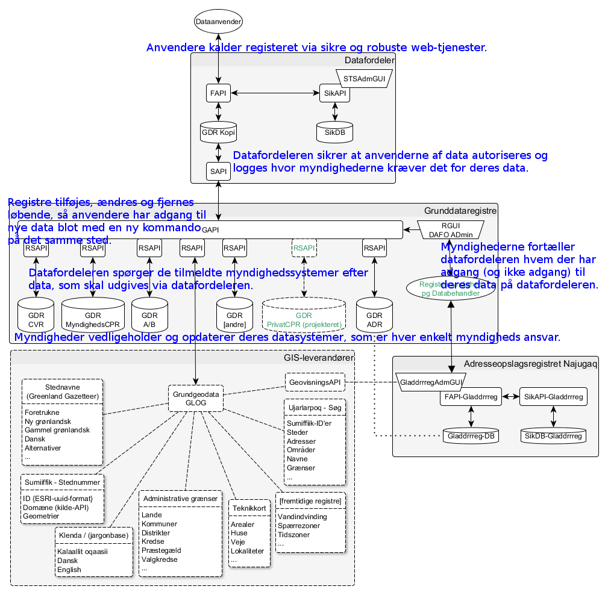

Systemet
========

Principperne for datafordeleren
-------------------------------

1. Myndigheder vedligeholder og opdaterer deres datasystemer, som er hver enkelt myndigheds ansvar.
2. Datafordeleren spørger de tilmeldte myndighedssystemer efter data, som skal udgives via datafordeleren.
3. Myndighederne fortæller datafordeleren hvem der har adgang (og ikke adgang) til deres data på datafordeleren.
4. Anvendere kalder registeret via sikre og robuste web-tjenester.
5. Datafordeleren sikrer at anvenderne af data autoriseres og logges hvor myndighederne kræver det for deres data.
6. Registre tilføjes, ændres og fjernes løbende, så anvendere har adgang til nye data blot med en ny kommando på det samme sted.

Opbygningen af datafordeleren
-----------------------------

Skitsen viser datafordelerens hovedkomponenter. For dataanvendere ses ikke andet end API'erne på data.gl. 

Tegningen viser hvor de seks principper kommer til udtryk. De tekniske ord på tegningen findes i Datafordelerens :ref:`Ordliste <wordlist>`

