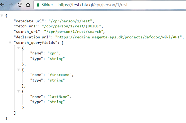

.. _dafo-api:

Grønlands Datafordeler API
==========================

.. toctree::
   :caption: Indhold
   :maxdepth: 1

   api-declarations
   api-connection
   api-results
   json

Anvendelse af API er underlagt :ref:`betingelser for anvendelse <agreements>` af Datafordeleren og dens formidlede data. API findes på https://test.data.gl/ 

API'er og deklarationer
-----------------------

Generelt gælder det at: 

* API'er er selvdeklarerende RESTfull API'er og de er alle af typen ``GET``.
* Navngivning af URL til API følger hovedreglen: ``/ et kort registernavn (f.eks. cpr) / et versionnummer f.eks. (1) / API-type (f.eks. rest) /`` og så følger parametrene.
* Et kald til roden på de enkelte API'er giver en liste over parametre, der er tilgængelige i API'et.
* Uddybning af felter, navne, deres anvendelse og særlige betingelser findes hos de respektive myndigheder, der udstiller data via datafordeleren.

    * Eventuelle afvigelser og særlige forhold for Datafordeleren vil være nævnt i deklarationen.

* De resulterende svarformater er beskrevet på siden om :ref:`JSON-formatet. <json-results>`

Et eksempel på deklarationskald til API
---------------------------------------

Et kald som ``https://test.data.gl/cpr/person/1/rest`` giver resultat som på billedet. Opsætningen kan variere fra browser til browser. 

Selvdeklarationen af et API på datafordeleren rummer disse oplysninger:

* "metadata_url": Adressen på metadata om API'et
* "fetch_url": Adressen til at hente oplysninger ved personens unikke UUID, der alene anvendes i Datafordeleren"
* "search_url": Adressen til søgning på API'et
* "declaration_url": Web-adressen til :ref:`betingelser <agreements>` for anvendelse af API'et
* "search_queryfields": Oversigten over søgefelter på det aktuelle API
* "name": Navn(ene) på de tilgængelige søgefelter
* "type": Datatypen der skal anvendes ved søgningen

Uddybning af feltnavnene og deres indhold samt anvendelse er dokumenteret hos de ansvarlige myndigheder for registret. Hvor det er muligt, vil der være link til myndighedens databeskrivelse. Eventuelle særlige forhold i forbindelse med Datafordeleren vil være nævnt i deklarationen af API'et.

Søgemønstre i API-søgninger
---------------------------

Søgning skrives i en parameterform som ``search?felt=værdi``

Alle tilgængelige objekter bliver gennemsøgt for værdien i det nævnte søgefeltnavn. 

Asterisk (stjerne) repræsenterer nul, et eller mange vilkårlige tegn; ``search?navn=Pa*aq`` finder alt der begynder med pa og ender med aq, f.eks. Paninnguaq. Asterisk kan anbringes først, midt i, eller sidst i søgeordet.

